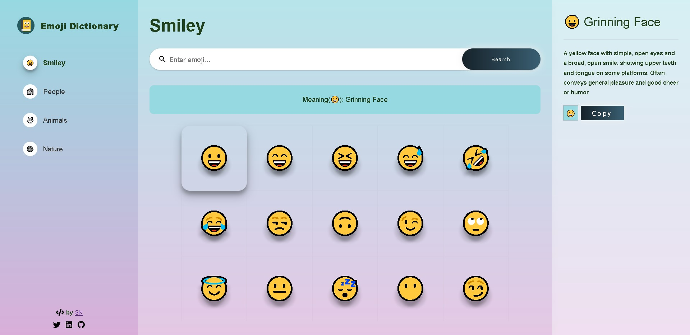

# Emoji Dictionar App

Emoji Dictionary app built using React. User can type the emoji and find its meaning and description. Also has search functionality which needs to be improved further. Fully responsive web application. It currently uses hardcoded database with 4 categories of emojis 15 each. More can be added or an api/json can be used instead.

Parcel used for bundling and hosted on Netlify.

## Installation

Clone the repository or download it as zip.

Install dependencies:

```
npm install
```

Compile and run the CLI app:

```
npm run dev
```

## Demo



Online demo available at [emoji-dict](https://emoji-dict.netlify.app/).
